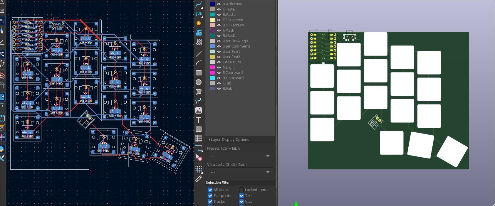

# Ultra Choc Wings



A 36-key split keyboard for Kailh PG1316S switches, based on the
[Triboard](https://github.com/tarneaux/triboard).

* **36 keys**: 3×5 plus 3 thumb keys per half.
* **Chocofi layout**: 18 × 17 mm key spacing, the same column stagger and the
  same thumb cluster (0°, 15°, 30° fan) as the
  [chocofi](https://github.com/pashutk/chocofi), so keymaps, keycaps and muscle
  memory carry over. The stagger is Fifi's, which Chocofi kept in mm.
* **One reversible PCB** for both halves. The right half is the same board
  flipped over.
* **Per-key LEDs** (single colour, PWM dimmed, off by default).
* **CR2032 coin cell** per half, with a power switch.
* **ZMK with a dongle**: a third XIAO nRF52840 on USB is the central, both
  halves are low-power peripherals.
* **Seeed XIAO nRF52840** on each half.
* **JLCPCB ready**: gerbers, BOM and placement files for both halves; all SMD
  parts are assembled by JLCPCB on one side per half.
* **Two cases**: a thin folding case after Aronia's (opens flat as a uniboard,
  folds shut), and split trays that join into a uniboard or work apart.

| Folder | What's in it |
| --- | --- |
| `config.yaml`, `footprints/` | Ergogen source of the PCB |
| `pcb/` | Routed KiCad board and DRC report |
| `jlcpcb/` | Gerbers, BOM and CPL files, [ordering guide](jlcpcb/README.md) |
| `firmware/` | ZMK config: dongle, left, right, keymap |
| `case/` | Folding and split cases, [notes](case/README.md) |
| `docs/power.md` | [Coin cell vs. LEDs](docs/power.md), the power budget |
| `archive/v1-lipo/` | The earlier hand-routed LiPo version |

## Coin cell and LEDs

A CR2032 cannot run 18 LEDs for long. The LEDs share one MOSFET, so when they
are off they draw nothing; the firmware keeps them off at boot, starts them at
10 % when you toggle them on (LOWER + RAISE, then `BL_TOG`), and turns them off
whenever the half goes idle. See [docs/power.md](docs/power.md) for the numbers
and the option of running from a LiPo instead.

## Firmware

`firmware/` is a ZMK user config (ZMK v0.3). GitHub Actions builds it on every
push (`.github/workflows/zmk.yml`); download the `firmware` artifact and flash:

* `ultra_choc_wings_dongle` onto the XIAO that stays plugged into the computer,
* `ultra_choc_wings_left` and `ultra_choc_wings_right` onto the halves,
* `settings_reset` first if the boards were paired to something before.

The keymap is `firmware/ultra_choc_wings.keymap` (QWERTY with LOWER, RAISE and
ADJUST layers).

## Building the PCB

```sh
npm install
KICAD_PYTHON=python3 FREEROUTING_JAR=path/to/freerouting.jar scripts/build_pcb.sh
```

This runs Ergogen, autoroutes with [Freerouting](https://github.com/freerouting/freerouting),
joins the few connections Freerouting misreads around the flippable XIAO
pads (`scripts/finish_routes.py`), adds ground pours on both layers, writes a DRC report, exports gerbers, the
JLCPCB BOM/CPL files and the cases. It needs KiCad 7 or newer (with its Python
module), Java, and `xvfb-run` on a headless machine. The committed board was
autorouted; review it in KiCad before ordering and hand-tidy any routes you
don't like.

`pcb/drc.rpt` has no unconnected items. The remaining entries are known: the
flippable XIAO footprint's solder jumpers sit closer than the default clearance
and hole clearance by design, solder mask bridges between those jumpers,
library-footprint notes (the footprints are generated, not from a library),
and silkscreen overlaps.

## Assembly notes

* All SMD parts, the switches and the XIAO go on the **same side** of each
  PCB: the front for the left half, the back for the right half.
* Bridge the `[> ]` jumper pads under the XIAO on the side the XIAO sits on.
* Wire the **RAW** pad (next to the XIAO) to the BAT+ pad under the XIAO.

## Credits

- Inspiration: keyboards by [GEIGEIGEIST](https://github.com/GEIGEIGEIST), the [chocofi](https://github.com/pashutk/chocofi) and the [samoklava](https://github.com/wxsh/samoklava).
- Videos by Ben Vallack on YouTube.
- Kind people on the [ErgoMechKeyboards](https://lemmy.ml/c/ergomechkeyboards@lemmy.world) Lemmy community.
- FlatFootFox - [Let's Design A Keyboard With Ergogen v4](https://flatfootfox.com/ergogen-introduction/)
