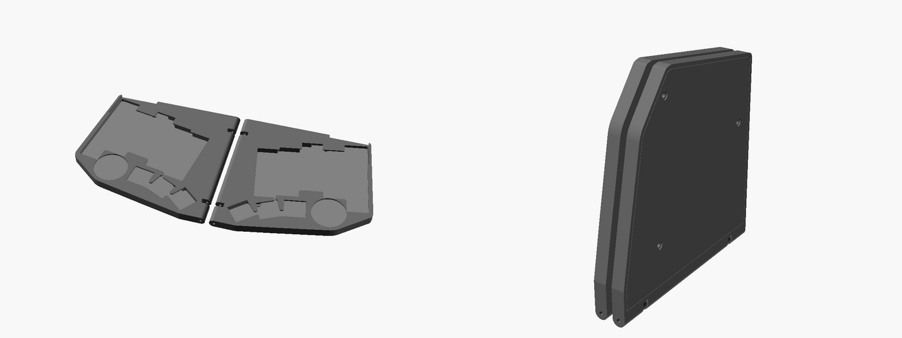
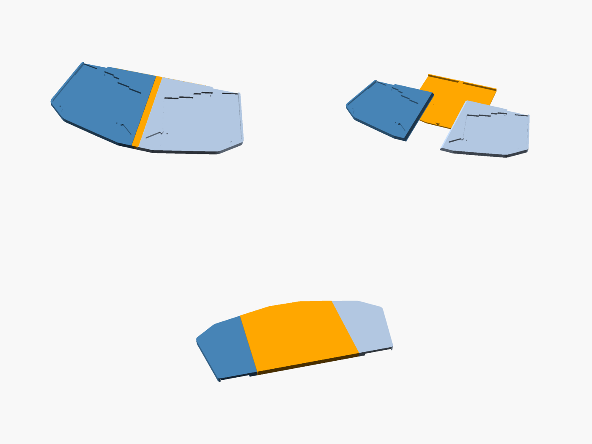

# Cases

There are two cases. Both are built around the same board data
(`board.scad`, generated from the PCB by `scripts/make_case.py`) and give the
same uniboard outline when opened out.

| | Folding (`fold.scad`) | Split (`split.scad`) |
| --- | --- | --- |
| Style | Thin frame and bottom cover per half, after the [Aronia](https://github.com/kumekay/aronia/tree/main/case) case | Open tray per half, like the earlier one-piece tray |
| Joining | Double hinge on two brass rods: open flat as a uniboard, or fold shut like a book | One clip slides on from the back, no screws or tools: a base under both halves and a bridge across the top make a rigid uniboard; slide it off to use the halves apart |
| Size per half | about 120 × 110 × 7.2 mm; 17.8 mm thick folded | about 119 × 114 × 5.6 mm; 7.6 mm thick on the clip |

Printed STLs are in `stl/`. The right-hand parts are mirror images of the
left (the right PCB is the same board flipped over).

## Folding case

Each half is a frame around the PCB with a top deck level with the keycaps and
one opening over the key cluster, plus windows for the XIAO and the CR2032
holder. A flat cover closes the bottom.

Parts: `fold_left_frame`, `fold_right_frame`, `fold_left_cover`,
`fold_right_cover`, and 2 × `fold_link`. You also need:

* 2 × 2 mm brass rod, each about 110 mm (cut to the length of the hinge edge),
* 6 × M2 × 6 mm screws, low-profile (wafer) heads,
* stick-on rubber feet for the covers.

Assembly: put the PCB into the frame from below, switch side up. Lay the
cover on (its spacers keep the PCB 1 mm off it), and drive the three screws up
through the cover and PCB into the bosses under the deck. Stand the two halves
edge to edge, put the links into the slots, and push one rod through each
half's hinge edge and the links. Folded, the decks face each other with a gap
that clears the XIAO and the CR2032 holder.

Unlike Aronia there are no gears, so the two hinges are not synced; the halves
still fold and open, each on its own rod.

Print the frames deck down, the covers flat, the links flat. No supports.

## Split case

Each tray is a complete case for one half: the PCB drops into its pocket and
sits flat on the floor (every SMD part is on the switch side, so the bottom is
bare), held by three M2 × 4 mm screws that self-tap into the floor. For
heat-set inserts set `pilot_d = 3.2`. The CR2032 is reachable from the top, and
a notch in the top wall clears the XIAO's USB-C port and the power switch.

To join the halves, use `split_clip`. It is shaped like an I-beam:

* a wide base plate that goes under both trays and covers about half of each
  one's underside,
* a thin web that runs up through the seam between the trays,
* a small wedge-shaped bridge on top that sits flush in a groove along the
  seam.

Lay the clip on the desk, set the two trays on it either side of the web, and
slide them forward until their back edges meet the lip at the back of the
clip, where two small bumps click into dimples under the trays. You can also
slide the clip in from the back edge of the trays. The base carries both
halves from below and the bridge holds them down from the top, so the joined
board is one rigid piece. It doesn't hinge at the seam and doesn't need a
flat surface under it. No screws or tools are needed. To split the board,
slide the clip off backwards.

If the clip is too loose or too tight on your printer, change `clip_clr`. Put
rubber feet under the clip's base and under the outer halves of the trays.

Parts: `split_left`, `split_right` and `split_clip`. Print everything flat:
the trays floor down, and the clip base down so the web and bridge print
upwards. The bridge's 45° sides need no supports.

## Changing them

Open `fold.scad` or `split.scad` in OpenSCAD and change the parameters at the
top (splay, wall and floor thickness, clearances, component heights, hinge
and clip sizes), then preview with `part = "assembly"` (or `"folded"`). Export
all STLs with `scripts/build_case.sh`.

Measure your parts before printing the folding case: `key_h` (switch height
above the PCB, sets the deck height), `xiao_h` and `coin_h` (they set the fold
gap), and `under_gap` (what pokes out under the PCB) are estimates.

`board.scad` is regenerated by `scripts/build_pcb.sh` from the routed PCB, so
both cases follow any change to `config.yaml`.

0.2 mm layers, 3 walls.
